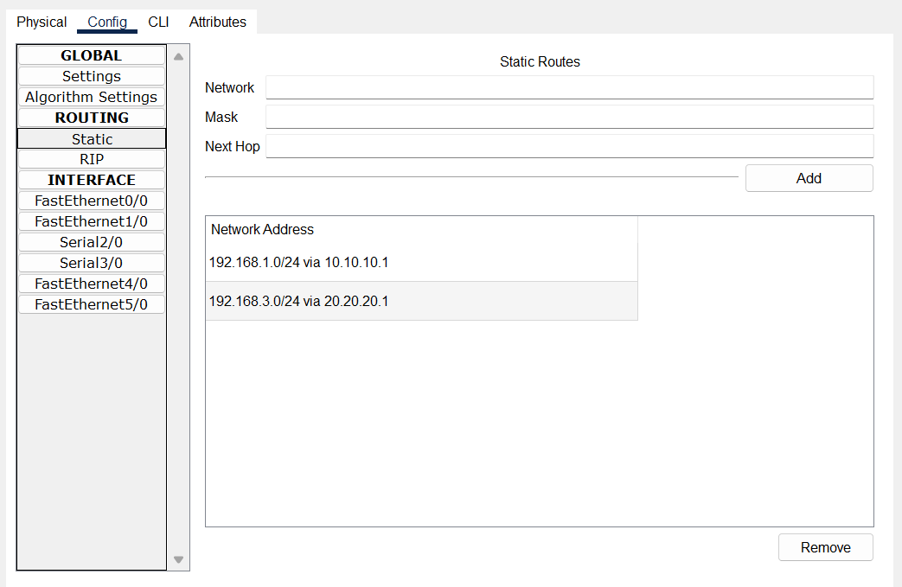

# 🌐 Tutorial Konfigurasi Static Routing dengan 3 Router di Cisco Packet Tracer

## 📌 1. Alat dan Bahan
Sebelum memulai, siapkan perangkat dan kabel berikut di **Cisco Packet Tracer**:

- **Router** : 3 unit (Router0, Router1, Router2)  
- **Switch** : 3 unit (Switch0, Switch1, Switch2)  
- **PC** : 6 unit (PC1 – PC6)  
- **Kabel** : 
  - **Copper Straight-Through** (untuk PC ↔ Switch, Switch ↔ Router)  
  - **Serial DCE/DTE** (untuk Router ↔ Router)

---

## 🖼️ 2. Topologi Jaringan  
Topologi jaringan yang digunakan:

```
[PC1]---+
        |       [Router0] -------- [Router1] -------- [Router2] 
[PC2]---+        10.10.10.1        10.10.10.2        20.20.20.1
        |           |                  |                  |
     [Switch0]   192.168.1.100     192.168.2.100     192.168.3.100
                   |   |              |    |             |    |
                [PC1][PC2]        [PC3][PC4]        [PC5][PC6]
```
<p align="center">
  <br>
  <b>Gambar 1.</b> Topologi Jaringan Static 3 Routing
</p>
---

## ⚙️ 3. Pembagian IP Address
| Perangkat | Interface | IP Address   | Subnet Mask     | Gateway       |
|-----------|-----------|--------------|-----------------|---------------|
| Router0   | Fa0/0     | 192.168.1.100 | 255.255.255.0 | -             |
| Router0   | S0/0/0    | 10.10.10.1    | 255.255.255.0 | -             |
| Router1   | S0/0/0    | 10.10.10.2    | 255.255.255.0 | -             |
| Router1   | Fa0/0     | 192.168.2.100 | 255.255.255.0 | -             |
| Router1   | S0/0/1    | 20.20.20.2    | 255.255.255.0 | -             |
| Router2   | S0/0/0    | 20.20.20.1    | 255.255.255.0 | -             |
| Router2   | Fa0/0     | 192.168.3.100 | 255.255.255.0 | -             |
| PC1       | NIC       | 192.168.1.1   | 255.255.255.0 | 192.168.1.100 |
| PC2       | NIC       | 192.168.1.2   | 255.255.255.0 | 192.168.1.100 |
| PC3       | NIC       | 192.168.2.1   | 255.255.255.0 | 192.168.2.100 |
| PC4       | NIC       | 192.168.2.2   | 255.255.255.0 | 192.168.2.100 |
| PC5       | NIC       | 192.168.3.1   | 255.255.255.0 | 192.168.3.100 |
| PC6       | NIC       | 192.168.3.2   | 255.255.255.0 | 192.168.3.100 |

---

## 🛠️ 4. Konfigurasi Router  

### 🔹 Router0
```bash
Router> enable
Router# configure terminal
Router(config)# interface fa0/0
Router(config-if)# ip address 192.168.1.100 255.255.255.0
Router(config-if)# no shutdown
Router(config)# interface s2/0
Router(config-if)# ip address 10.10.10.1 255.255.255.0
Router(config-if)# clock rate 64000
Router(config-if)# no shutdown
Router(config)# ip route 192.168.2.0 255.255.255.0 10.10.10.2
Router(config)# ip route 192.168.3.0 255.255.255.0 10.10.10.2
```
<p align="center">
  
  
</p>

<p align="center">
  <b>Gambar 2.</b> Konfigurasi Router0 Fa0/0 &nbsp;&nbsp;&nbsp;&nbsp;
  <b>Gambar 3.</b> Konfigurasi Router0 S2/0
</p>

```
```
### 🔹 Router1
```bash
Router> enable
Router# configure terminal
Router(config)# interface fa0/0
Router(config-if)# ip address 192.168.2.100 255.255.255.0
Router(config-if)# no shutdown
Router(config)# interface s2/0
Router(config-if)# ip address 10.10.10.2 255.255.255.0
Router(config-if)# no shutdown
Router(config)# interface s3/0
Router(config-if)# ip address 20.20.20.2 255.255.255.0
Router(config-if)# no shutdown
Router(config)# ip route 192.168.1.0 255.255.255.0 10.10.10.1
Router(config)# ip route 192.168.3.0 255.255.255.0 20.20.20.1
```
<p align="center">
  
  
  
</p>

<p align="center">
  <b>Gambar 4.</b> Konfigurasi Router1 Fa0/0 &nbsp;&nbsp;&nbsp;&nbsp;
  <b>Gambar 5.</b> Konfigurasi Router1 S2/0 &nbsp;&nbsp;&nbsp;&nbsp;
  <b>Gambar 6.</b> Konfigurasi Router1 S3/0
</p>


### 🔹 Router2
```bash
Router> enable
Router# configure terminal
Router(config)# interface fa0/0
Router(config-if)# ip address 192.168.3.100 255.255.255.0
Router(config-if)# no shutdown
Router(config)# interface s2/0
Router(config-if)# ip address 20.20.20.1 255.255.255.0
Router(config-if)# clock rate 64000
Router(config-if)# no shutdown
Router(config)# ip route 192.168.1.0 255.255.255.0 20.20.20.2
Router(config)# ip route 192.168.2.0 255.255.255.0 20.20.20.2
```
<p align="center">
  
  
</p>

<p align="center">
  <b>Gambar 7.</b> Konfigurasi Router2 Fa0/0 &nbsp;&nbsp;&nbsp;&nbsp;
  <b>Gambar 8.</b> Konfigurasi Router2 S2/0
</p>

---
## 📌 5. Konfigurasi Static Routing

### 🔹 Router0
```bash
Router(config)# ip route 192.168.2.0 255.255.255.0 10.10.10.2
Router(config)# ip route 192.168.3.0 255.255.255.0 10.10.10.2
```

### 🔹 Router1
```bash
Router(config)# ip route 192.168.1.0 255.255.255.0 10.10.10.1
Router(config)# ip route 192.168.3.0 255.255.255.0 20.20.20.1
```
### 🔹 Router2
```bash
Router(config)# ip route 192.168.1.0 255.255.255.0 20.20.20.2
Router(config)# ip route 192.168.2.0 255.255.255.0 20.20.20.2
```
<p align="center">
  
  
  
</p>

<p align="center">
  <b>Gambar 9.</b> Konfigurasi Static Router0 &nbsp;&nbsp;&nbsp;&nbsp;
  <b>Gambar 10.</b> Konfigurasi Static Router1 &nbsp;&nbsp;&nbsp;&nbsp;
  <b>Gambar 11.</b> Konfigurasi Static Router2
</p>

## 📌 6. Konfigurasi Routing dengan RIP

### 🔹 Router0
```bash
Router(config)# router rip
Router(config-router)# version 2
Router(config-router)# network 192.168.1.0
Router(config-router)# network 10.10.10.0
```

### 🔹 Router1
```bash
Router(config)# router rip
Router(config-router)# version 2
Router(config-router)# network 192.168.2.0
Router(config-router)# network 10.10.10.0
Router(config-router)# network 20.20.20.0
```

### 🔹 Router2
```bash
Router(config)# router rip
Router(config-router)# version 2
Router(config-router)# network 192.168.3.0
Router(config-router)# network 20.20.20.0
```
<p align="center">
  
  
  
</p>

<p align="center">
  <b>Gambar 12.</b> Konfigurasi RIP Router0 &nbsp;&nbsp;&nbsp;&nbsp;
  <b>Gambar 13.</b> Konfigurasi RIP Router1 &nbsp;&nbsp;&nbsp;&nbsp;
  <b>Gambar 14.</b> Konfigurasi RIP Router2
</p>

## 💻 7. Konfigurasi IP Address  
📍 **Subnet 1 – 192.168.1.0/24**  
| Perangkat | IP Address   | Subnet Mask     | Default Gateway |
|-----------|--------------|-----------------|-----------------|
| PC1       | 192.168.1.1  | 255.255.255.0   | 192.168.1.100   |
| PC2       | 192.168.1.2  | 255.255.255.0   | 192.168.1.100   |

<p align="center">
  
  
</p>

<p align="center">
  <b>Gambar 15.</b> Konfigurasi IP PC 1 &nbsp;&nbsp;&nbsp;&nbsp;
  <b>Gambar 16.</b> Konfigurasi IP PC 2
</p>

📍 **Subnet 2 – 192.168.2.0/24**  
| Perangkat | IP Address   | Subnet Mask     | Default Gateway |
|-----------|--------------|-----------------|-----------------|
| PC3       | 192.168.2.1  | 255.255.255.0   | 192.168.2.100   |
| PC4       | 192.168.2.2  | 255.255.255.0   | 192.168.2.100   |

<p align="center">
  
  
</p>

<p align="center">
  <b>Gambar 17.</b> Konfigurasi IP PC 3 &nbsp;&nbsp;&nbsp;&nbsp;
  <b>Gambar 18.</b> Konfigurasi IP PC 4
</p>

📍 **Subnet 3 – 192.168.3.0/24**  
| Perangkat | IP Address   | Subnet Mask     | Default Gateway |
|-----------|--------------|-----------------|-----------------|
| PC5       | 192.168.3.1  | 255.255.255.0   | 192.168.3.100   |
| PC6       | 192.168.3.2  | 255.255.255.0   | 192.168.3.100   |

<p align="center">
  
  
</p>

<p align="center">
  <b>Gambar 19.</b> Konfigurasi IP PC 5 &nbsp;&nbsp;&nbsp;&nbsp;
  <b>Gambar 20.</b> Konfigurasi IP PC 6
</p>

##  🔍 8. Pengujian Koneksi 
Setelah semua konfigurasi selesai:
 Coba **ping antar PC lintas jaringan**.  

 ✅ **PC1 ↔ PC6**  
 ```bash
 PC1> ping 192.168.3.2
 Reply from 192.168.3.2: bytes=32 time<1ms TTL=128
 ```
 
 <p align="center">
   <br>
   <b>Gambar 21.</b> Hasil uji ping PC1 ke PC6
 </p>
  ```

✅**PC2 ↔ PC3**   
 ```bash
 PC1> ping 192.168.2.1
 Reply from 192.168.2.1: bytes=32 time<1ms TTL=128
 ```
 
 <p align="center">
   <br>
   <b>Gambar 22.</b> Hasil uji ping PC2 ke PC3
 </p>

 ✅ **PC4 ↔ PC5**  
 ```bash
 PC1> ping 192.168.3.1
 Reply from 192.168.3.1: bytes=32 time<1ms TTL=128
 ```
 
 <p align="center">
   <br>
   <b>Gambar 23.</b> Hasil uji ping PC4 ke PC5
 </p>
 ```
---

## 📌 9. Kesimpulan
- Dengan konfigurasi **Static Routing**, setiap router diberi tahu secara manual jalur menuju jaringan lain.  
- Topologi ini memungkinkan komunikasi antar **3 LAN berbeda** (192.168.1.0/24, 192.168.2.0/24, 192.168.3.0/24).  
- Static Routing cocok untuk topologi kecil, tetapi pada jaringan besar lebih baik gunakan **Dynamic Routing (RIP, OSPF, EIGRP)**.  

✍️️ **Author:** Dokumentasi Jaringan Cisco – *Static Routing Topology Putra Rizki. F*