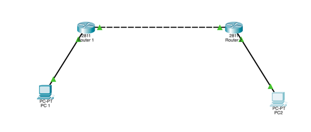
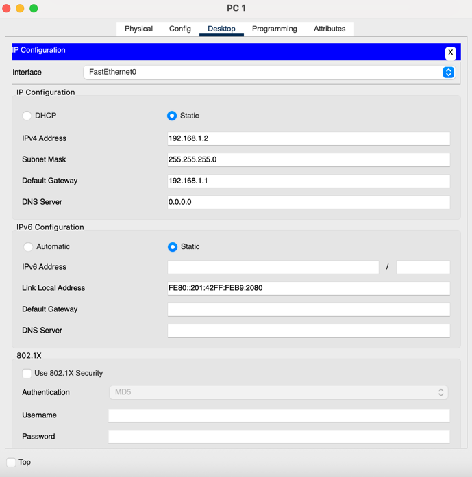
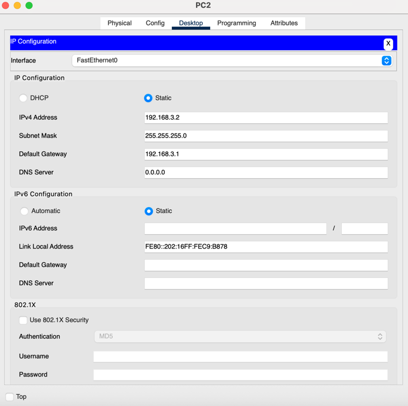
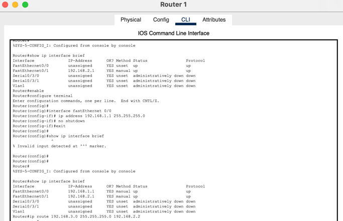
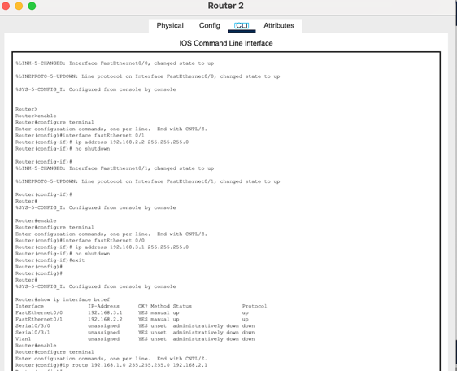
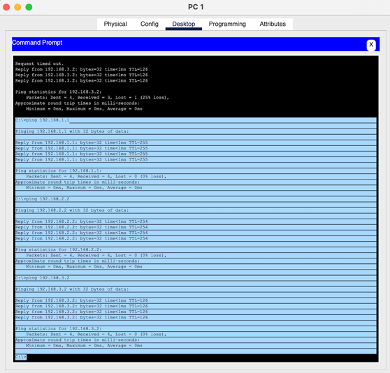
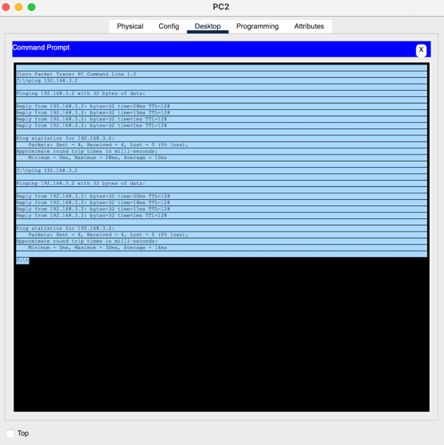
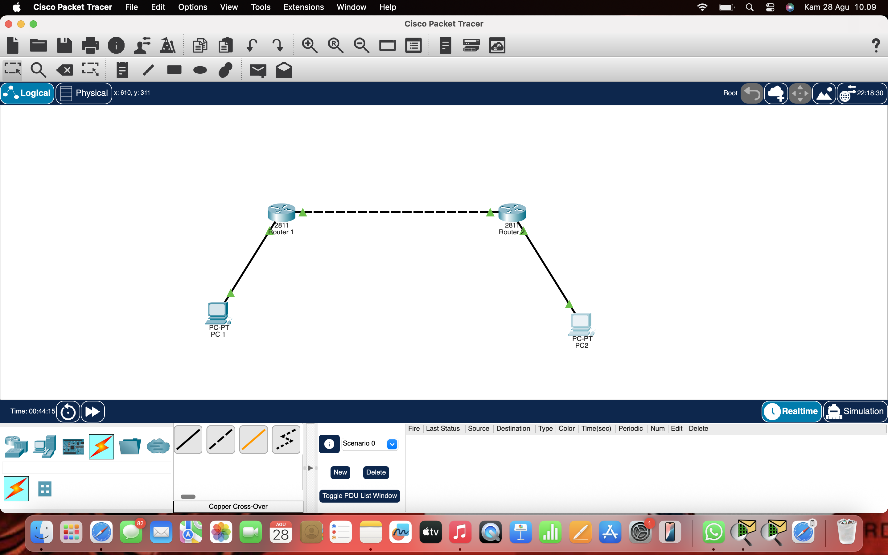

# 🌐 Cisco Packet Tracer - Static Routing Topology

Proyek ini berisi simulasi jaringan menggunakan **Cisco Packet Tracer**, dengan topologi sederhana 2 Router dan 2 PC.  
Tujuan utama adalah **mengenal static routing**, bagaimana dua jaringan berbeda bisa saling terhubung melalui router.

---

## 🖼️ Topologi Jaringan

- **PC1** terhubung ke Router1  
- **Router1** terhubung ke Router2  
- **Router2** terhubung ke PC2  

---

## 📑 Spesifikasi Perangkat

- **Router**: Cisco 2811 (2 unit)  
- **PC**: End Device (2 unit)  
- **Kabel**:  
  - Copper Straight-Through → PC ↔ Router  
  - Copper Cross-Over → Router ↔ Router (FastEthernet)  
  - *Jika ingin belajar serial, gunakan modul WIC-2T dan kabel Serial DCE/DTE*  

---

## 🔧 Konfigurasi IP Address

### PC1
- IP Address: `192.168.1.2`  
- Subnet Mask: `255.255.255.0`  
- Default Gateway: `192.168.1.1`  

### PC2
- IP Address: `192.168.3.2`  
- Subnet Mask: `255.255.255.0`  
- Default Gateway: `192.168.3.1`  

### Router1
```bash
interface fastEthernet 0/0
 ip address 192.168.1.1 255.255.255.0
 no shutdown

interface fastEthernet 0/1
 ip address 192.168.2.1 255.255.255.0
 no shutdown

ip route 192.168.3.0 255.255.255.0 192.168.2.2

```

### Router 2
```bash
interface fastEthernet 0/0
 ip address 192.168.3.1 255.255.255.0
 no shutdown

interface fastEthernet 0/1
 ip address 192.168.2.2 255.255.255.0
 no shutdown

ip route 192.168.1.0 255.255.255.0 192.168.2.1
```


## 🔍 Pengujian Koneksi

Setelah semua perangkat dikonfigurasi, lakukan pengujian dengan **ping** antar perangkat:
### PC 1


### PC 2



Jika konfigurasi sudah benar, maka hasilnya akan **Reply** dari host tujuan ✅

---

## 📡 Hasil Topologi

Berikut adalah hasil topologi jaringan yang dibuat di **Cisco Packet Tracer**:



---

## ✨ Kesimpulan

1. Topologi ini menghubungkan **PC1 ↔ Router1 ↔ Router2 ↔ PC2** dengan dua subnet berbeda.  
2. Router berhasil menghubungkan antar subnet dengan konfigurasi **static routing**.  
3. Pengujian ping menunjukkan konektivitas berjalan lancar.  

---

## 👨‍💻 Dibuat Oleh

**Putra Rizki. F**  
_Project Cisco Packet Tracer – Topologi Gambar 2_


