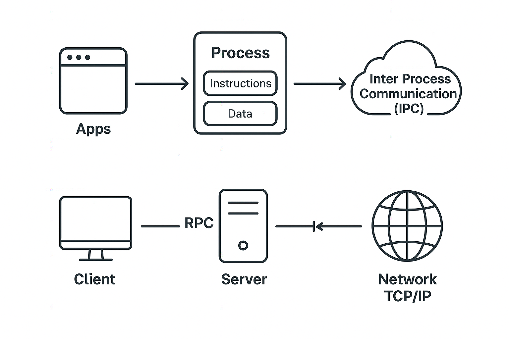
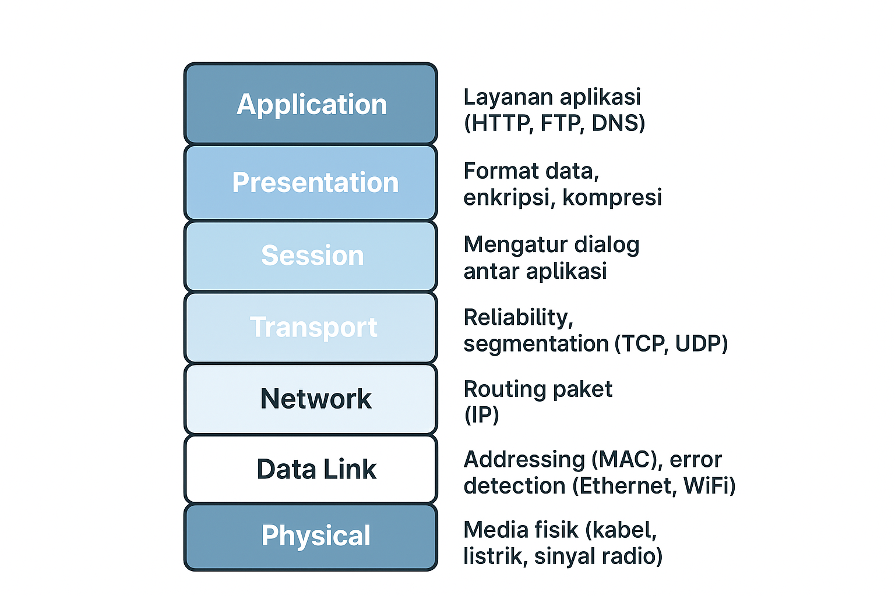
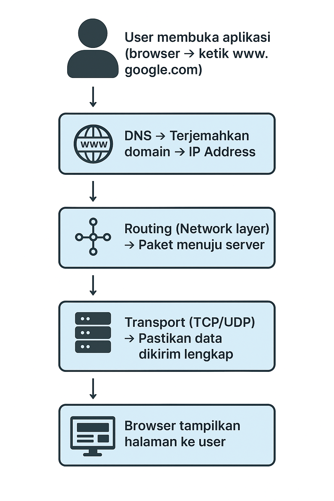
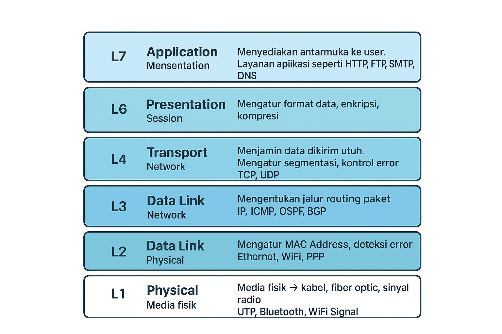
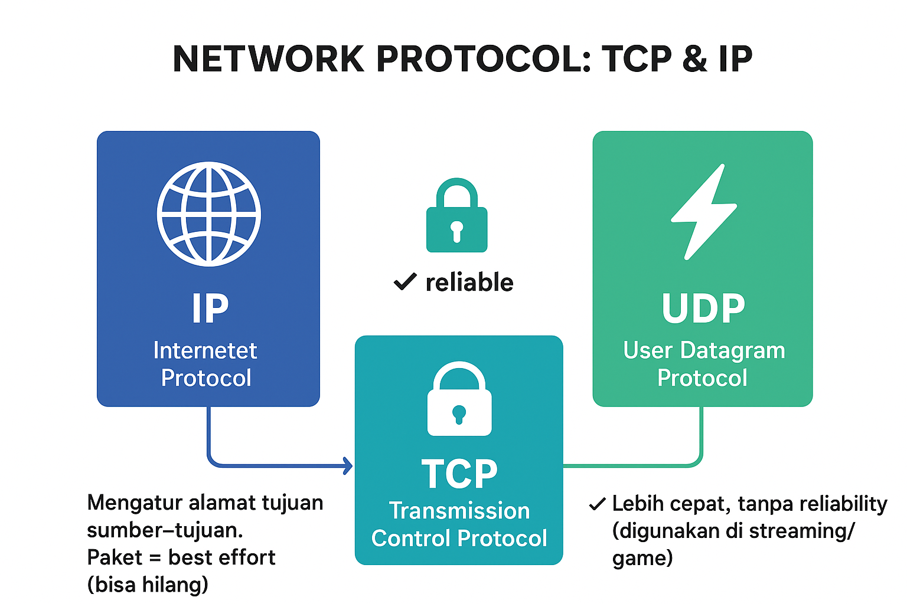
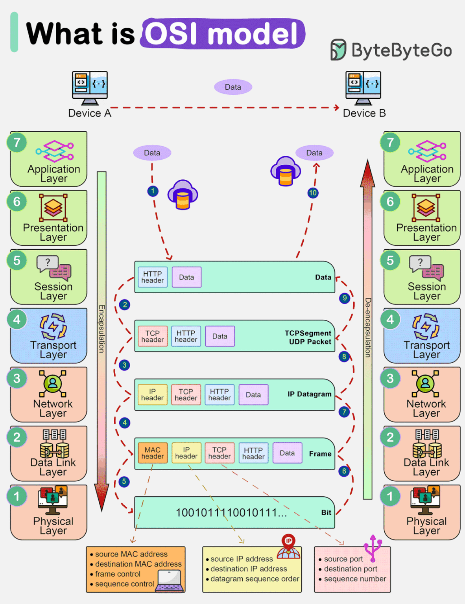
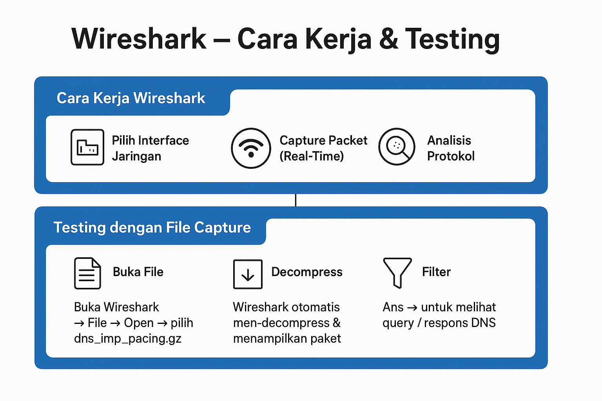
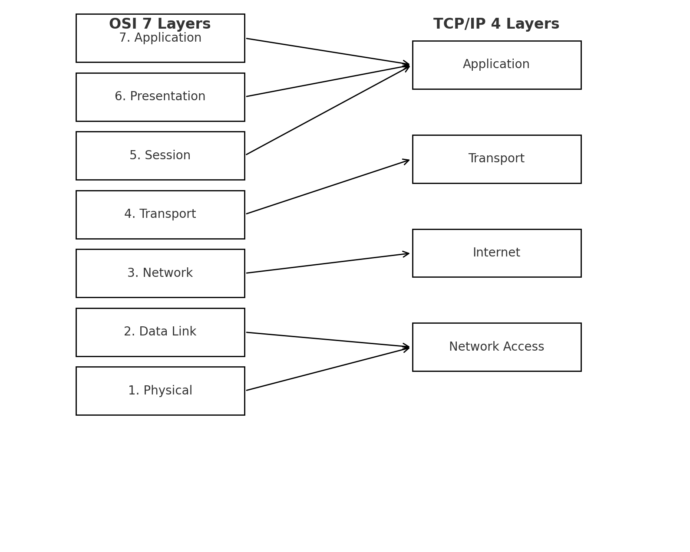

# 📡 Network Protocol - Dokumentasi Lengkap

Repositori ini berisi dokumentasi lengkap tentang **Network Protocol**, arsitektur komunikasi jaringan, serta penjelasan detail dari hardware, OS, proses komunikasi, OSI layer, TCP/IP, hingga penggunaan Wireshark untuk analisis jaringan.  

---

## 1. 🌐 Network Protocol
**Network Protocol** adalah seperangkat aturan yang mengatur bagaimana data dikirim, diterima, dan diproses di dalam jaringan komputer.  
Contoh: **TCP/IP, HTTP, FTP, DNS, DHCP, SMTP, POP3, IMAP**.  

Protokol ini memastikan perangkat yang berbeda bisa berkomunikasi dengan standar yang sama.

---

## 2. ⚙️ Hardware, Kernel, OS, Apps, User, CPU, Process
- **Hardware** → Perangkat fisik (CPU, RAM, NIC, router, switch).
- **Kernel** → Bagian inti OS, menghubungkan hardware dengan software.
- **OS (Operating System)** → Sistem pengatur komputer (Linux, Windows, macOS).
- **Apps** → Aplikasi yang digunakan user (browser, WhatsApp, game, dll).
- **User** → Orang yang menggunakan sistem.
- **CPU - Process** → CPU mengeksekusi instruksi aplikasi dalam bentuk proses.

---

## 3. 🚀 Aplikasi, Proses, dan Komunikasi
- **Apps yang sedang dieksekusi** → Menjadi **process** di CPU.
- **Komunikasi antar process** → Bisa melalui **Inter-Process Communication (IPC)**.
- **Remote Procedure Call (RPC)** → Memungkinkan satu program memanggil fungsi di komputer lain.
- **Network TCP/IP** → Digunakan untuk komunikasi data antar komputer.

---

## 4. 📑 ISO-OSI Model
Model **OSI (Open Systems Interconnection)** memiliki **7 layer**:

1. **Physical** → Transmisi bit (kabel, fiber, sinyal).
2. **Data Link** → Pengalamatan fisik (MAC Address, Ethernet).
3. **Network** → Routing & IP Address.
4. **Transport** → Segmentasi data (TCP/UDP).
5. **Session** → Mengatur koneksi antar aplikasi.
6. **Presentation** → Enkripsi, kompresi, format data.
7. **Application** → Layanan aplikasi (HTTP, FTP, DNS).

---

## 5. 🌍 Internet & Alur Kerjanya
Alur sederhana Internet:
1. User membuka aplikasi (misalnya browser).
2. Aplikasi membuat permintaan ke server (HTTP/HTTPS).
3. DNS menerjemahkan domain → IP Address.
4. Data dikirim via TCP/IP melewati router, switch, kabel, dll.
5. Server merespon → data kembali ke user.

---

## 6. 📦 Aturan TCP/IP
- **TCP (Transmission Control Protocol)** → Handshake, reliabilitas, segmentasi data.
- **IP (Internet Protocol)** → Pengalamatan & routing.
- Kombinasi ini membentuk **Internet Protocol Suite**.

---

## 7. 👥 Client dan User dalam OSI Layer
- **Application** → HTTP, FTP, DNS.
- **Presentation** → SSL/TLS, enkripsi.
- **Session** → Socket, sesi komunikasi.
- **Transport** → TCP/UDP.
- **Network** → IP.
- **Data Link** → Ethernet, MAC.
- **Physical** → Kabel, wireless.

---

## 8. 📡 Media Komunikasi & Pensinyalan
1. **Cable (UTP/STP)** → Murah, mudah dipasang.
2. **Fiber Optic** → Cepat, tahan interferensi.
3. **Radio Frequency (Wireless/Wi-Fi)** → Praktis, tapi rawan gangguan.

---

## 9. 🔍 Wireshark & Testing
**Wireshark** adalah tool untuk menganalisis paket data jaringan.  

### Cara kerja:
1. Menangkap paket (capture) dari interface jaringan.
2. Menampilkan detail tiap paket (src IP, dst IP, protokol, payload).
3. Memungkinkan filter untuk analisis spesifik (contoh: hanya DNS atau HTTP).

### Contoh Capture DNS:
- Gunakan file trace seperti `dns-imp-pacing.gz`.
- Buka di Wireshark → gunakan filter:
- Akan terlihat request & response DNS (domain → IP).

---

## 10. 📊 Diagram OSI vs TCP/IP

## 11. 🌍 Alur Kerja Internet (HTTP/HTTPS)

## 📌 Kesimpulan
- **Network Protocol** = aturan komunikasi antar perangkat.  
- **OSI & TCP/IP** = model komunikasi data.  
- **Wireshark** = alat analisis paket.  
- **Media komunikasi** → kabel, fiber, radio.  
- Semua ini bekerja bersama agar Internet bisa berjalan sebagaimana mestinya.  

---

✍️ Dibuat Oleh : Marthen Frikaldo Antaribaba

Untuk dokumentasi belajar & riset..  
